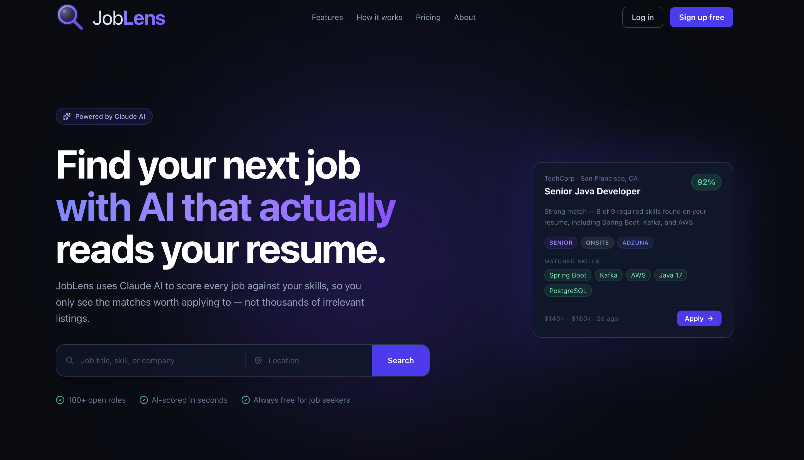
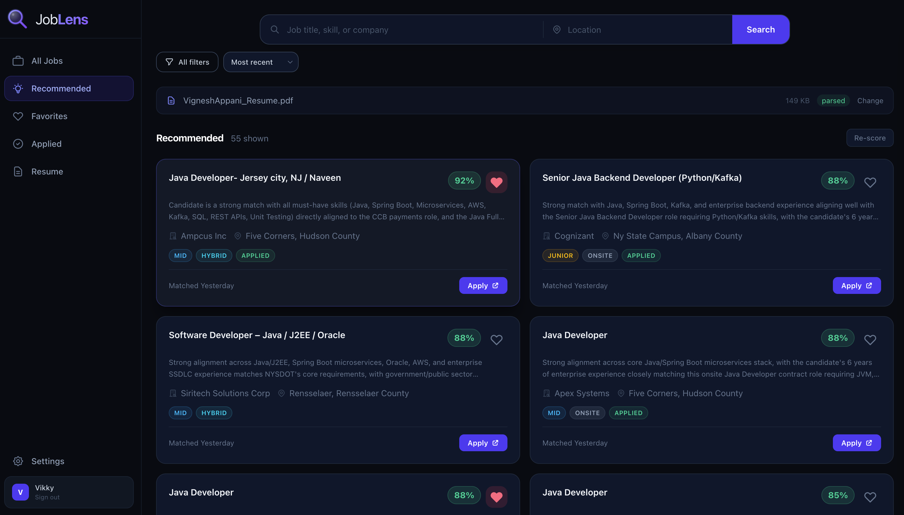
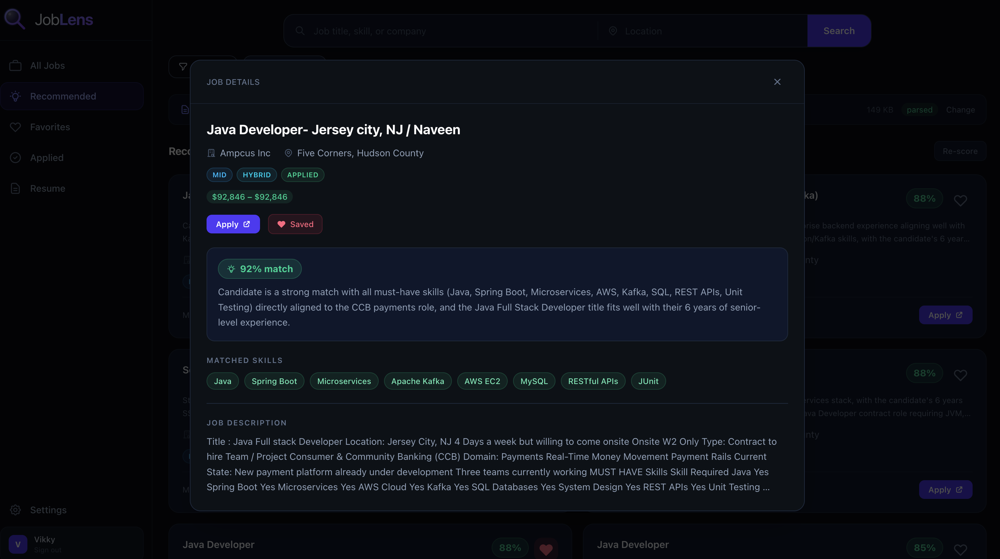
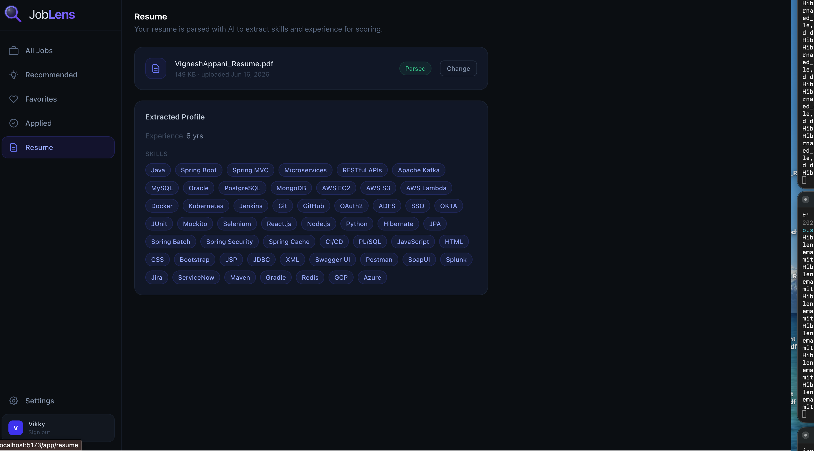

# JobLens

**AI-powered job matching that actually reads your resume.**

<p align="center">
  
  
  
  
  
  
  
  
  
  
</p>

JobLens fetches real job listings from the Adzuna API, sends your resume PDF to Claude for structured extraction, then scores every job in the database against your profile — returning only the listings you'd actually have a shot at. It is built for developers who are tired of keyword-based boards that surface 200 jobs because they contain the word "Java" somewhere in the footer.

The backend is a five-service Spring Boot 3.3 monorepo (Java 17, Maven multi-module). The frontend is a React 19 / TypeScript / Tailwind v4 SPA with per-tab filter state, a full auth flow, and a dark-only UI that holds up against professional tooling. This is a portfolio project — actively developed, not deployed.

---

## Screenshots

> Add your own screenshots to `docs/screenshots/` — see the [reminder at the bottom](#-author).


*Marketing landing page with hero search, how-it-works walkthrough, and powered-by strip*


*AI-scored job cards filtered to ≥ 70% match, sortable by score, salary, or recency*


*Centered detail modal showing matched skills, Claude reasoning, salary range, and apply link*


*Resume view showing upload status, Claude-extracted skills, and re-parse trigger*

---

## ✨ What it does

- **AI resume parsing** — upload your PDF and Claude (`claude-sonnet-4-6`) extracts your skills, years of experience, and seniority level into structured JSON. That JSON is what the scoring engine reads — not a bag of keywords.
- **AI job scoring** — every job in the database is scored 0–100 against your parsed profile. Skills, title fit, and experience fit each carry a defined weight. Jobs scoring ≥ 70 surface as recommended matches.
- **Parallel scoring** — Claude calls fan out concurrently via `CompletableFuture` into a dedicated thread pool, wrapped in Resilience4j circuit breakers and retry logic. A single flaky API call doesn't abort the run.
- **Real job data** — the job-aggregator-service polls Adzuna on a 6-hour schedule, deduplicates by external ID, and stores listings with salary, work mode, location, and description.
- **Favorites and applied tracking** — heart a job to save it; click Apply to open the original listing; confirm whether you applied when you return to the tab. Both states persist per user across sessions.
- **Forgot-password flow** — complete reset cycle via Gmail SMTP: single-use token with a 1-hour expiry, branded HTML email, and a dedicated `/reset-password` page.
- **Per-tab independent filter state** — filters on All Jobs, Recommended, Favorites, and Applied are tracked separately so switching views never clobbers your active search.
- **Filter drawer with chips** — filter by date posted, job level (Junior/Mid/Senior), work mode (Remote/Hybrid/Onsite), and minimum match score. Active filters render as chips; clicking a chip re-opens the drawer to that section.

---

## 🏗 Architecture

Five Spring Boot services share a single MySQL database (`joblens`). The frontend calls each service directly over REST — the API Gateway module exists in the repo but its route table is currently empty and it is not routing any traffic. It is a placeholder for future consolidation.

```
┌──────────────────────────────────────────────────────────┐
│                    React 19 SPA                          │
│            (Vite · TypeScript · Tailwind v4)             │
│                   localhost:5173                         │
└──────┬───────────┬──────────┬──────────┬────────────────┘
       │           │          │          │  (direct REST, no gateway yet)
       ▼           ▼          ▼          ▼
┌──────────┐ ┌─────────┐ ┌─────────┐ ┌──────────────────┐
│ user-    │ │ resume- │ │  job-   │ │   matching-      │
│ service  │ │ service │ │aggregat.│ │   service        │
│  :8081   │ │  :8082  │ │  :8083  │ │    :8084         │
│ JWT auth │ │ PDF +   │ │ Adzuna  │ │ Claude scoring   │
│ passwords│ │ Claude  │ │ sched.  │ │ Favorites/Applied│
│ SMTP mail│ │ parse   │ │ dedup   │ │ Job status       │
└────┬─────┘ └────┬────┘ └────┬────┘ └────────┬─────────┘
     │            │           │               │
     └────────────┴───────────┴───────────────┘
                              │
           ┌──────────────────┼──────────────────┐
           ▼                  ▼                  ▼
      ┌─────────┐        ┌─────────┐       ┌──────────┐
      │  MySQL  │        │  Redis  │       │  Kafka   │
      │  :3306  │        │  :6379  │       │  :9092   │
      └─────────┘        └─────────┘       └──────────┘

      External:
      ┌──────────────┐    ┌────────────────────────────┐
      │  Adzuna API  │    │  Anthropic Claude API       │
      │  (job fetch) │    │  claude-sonnet-4-6          │
      └──────────────┘    │  (resume parse + job score) │
                          └────────────────────────────┘

      ┌────────────────────────────────────────────────┐
      │  api-gateway :8080  (in repo, routes: [])      │
      │  Spring Cloud Gateway — not currently routing  │
      └────────────────────────────────────────────────┘
```

### Service summary

| Service | Port | Responsibility | Key dependencies |
|---|---|---|---|
| `api-gateway` | 8080 | Future request routing and rate limiting | Spring Cloud Gateway (WebFlux) |
| `user-service` | 8081 | Signup, login, JWT issuance, change-password, password reset emails | Spring Security, JJWT 0.12.6, Spring Mail |
| `resume-service` | 8082 | PDF upload (local storage), Claude parsing, parsed-JSON persistence | Spring Security, Resilience4j, spring-dotenv |
| `job-aggregator-service` | 8083 | Adzuna ingestion, 6-hour scheduled refresh, deduplication by external ID | Spring Batch, Kafka, Redis, Resilience4j |
| `matching-service` | 8084 | Claude job scoring, favorites, applied tracking, enriched job-status endpoint | Spring Security, Resilience4j, spring-dotenv |

---

## 🤖 The AI matching, in depth

**Resume parsing** happens immediately after upload. `resume-service` reads the PDF from local storage, Base64-encodes it, and sends it to `claude-sonnet-4-6` via the Anthropic Messages API. Claude returns structured JSON: a `skills` array, `yearsExperience`, and seniority level. That JSON is stored on the `Resume` row in MySQL. If Claude is unavailable at upload time the upload still succeeds — parsing is skipped silently and a `POST /api/resumes/parse` endpoint lets you retry without re-uploading.

**Job scoring** is triggered by `POST /api/matches/run`. The `matching-service` loads your parsed resume JSON, queries every job in MySQL, deletes your previous `JobMatch` rows, then fans out one Claude call per job using `CompletableFuture.runAsync` into a fixed thread pool. Each call sends the full candidate profile alongside the job title and up to 1,200 characters of the job description and asks for a 0–100 score plus attribute extraction in a single response.

**The scoring rubric** is embedded directly in the prompt Claude receives:

- **Skills (~45%)** — overlap between the candidate's tools and what the job requires or implies. Spring Boot implies Java; React implies JavaScript. Both explicit mentions and strong implications count.
- **Title fit (~30%)** — how well the job title aligns with the candidate's background and target level.
- **Experience fit (~25%)** — if the job requires fewer years than the candidate has, full marks. A 7–8 year requirement on a 3-year candidate draws a ~5–10 point deduction; 9–12+ years draws ~15–25 points. Experience alone never hard-rejects a candidate.

Claude also extracts `workMode` (Remote / Hybrid / Onsite) and `requiredYears` from the description text. `requiredYears` drives job level: ≤ 5 → Junior, 6–8 → Mid, > 8 → Senior. Matched skills (up to 8 items, taken verbatim from the candidate's profile) are stored as a JSON array on each `JobMatch` row and rendered in the detail modal.

**Resilience** is provided by Resilience4j on every Claude call: up to 2 retries with a 2-second backoff, and a circuit breaker that opens after 60% failure on a 10-call sliding window. A failed score for one job is logged and skipped without aborting the rest of the run. The same pattern applies to Adzuna calls in the aggregator (3 retries, 50% threshold on a 5-call window).

**Honest tradeoff**: sending every job through Claude is accurate and simple, but does not scale linearly in cost or time. At the current dev scale (~100 jobs) a scoring run takes 30–120 seconds and costs a few cents. At 10,000+ jobs the right architecture is a fast local pre-filter (TF-IDF or a small embedding model) that drops obvious mismatches, followed by Claude only for the top candidates. That hybrid approach is in the roadmap but premature to build at this stage.

---

## 🧰 Tech stack

**Backend**
- Java 17, Spring Boot 3.3.5, Maven multi-module (`joblens-parent`)
- Spring Security + JJWT 0.12.6 — HS256 tokens, 24-hour expiry, same secret validated statically in `resume-service` and `matching-service`
- Spring Data JPA / Hibernate (`ddl-auto: update` across all services)
- Spring Batch — ingestion pipeline in `job-aggregator-service`
- Spring Kafka — producer/consumer in `job-aggregator-service`
- Spring Data Redis — `job-aggregator-service`
- Spring Mail — Gmail SMTP, password reset emails (`user-service`)
- Resilience4j 2.2.0 — `@CircuitBreaker` + `@Retry` on Adzuna and Anthropic HTTP calls
- spring-dotenv 4.0.0 — loads root `.env` into the Spring `Environment` at startup

**Frontend**
- React 19, TypeScript 6, Vite 8
- Tailwind CSS v4 (Vite plugin, `@import "tailwindcss"`)
- react-router-dom v7 (BrowserRouter, Routes, NavLink)
- axios 1.x
- lucide-react (landing page icons)

**Data & infrastructure**
- MySQL 8 — single `joblens` schema shared by all five services
- Redis 7 — dedup/session cache in `job-aggregator-service`
- Apache Kafka 7.6.1 (Confluent image) + Zookeeper — all via Docker Compose
- Docker Compose — MySQL, Redis, Kafka, Zookeeper

**AI**
- Anthropic Claude `claude-sonnet-4-6` — resume parsing and job scoring
- Spring 6 `RestClient` for HTTP calls to the Anthropic Messages API

**Auth**
- JJWT for token issuance (`user-service`) and stateless filter-based validation (`resume-service`, `matching-service`)
- BCrypt password encoding
- Single-use, 1-hour-expiry tokens for password reset stored in `password_reset_tokens` table; daily cleanup scheduler

**Dev tooling**
- Lombok on all services
- Spring Boot Actuator `health` + `info` endpoints on all services
- ESLint + TypeScript strict mode on the frontend

---

## 🚀 Quick start

### Prerequisites

- Docker + Docker Compose
- Java 17
- Maven 3.8+
- Node.js 18+
- An [Anthropic API key](https://console.anthropic.com/) (Claude API — paid, billed per token)
- An [Adzuna developer account](https://developer.adzuna.com/) (free tier works)
- A Gmail App Password — only needed to test the forgot-password email flow. Gmail account → Security → 2-Step Verification → App passwords.

### Setup

**1. Clone**
```bash
git clone https://github.com/Appani23/JobLens.git
cd JobLens
```

**2. Create your `.env` file**
```bash
cp .env.example .env
```
Open `.env` and fill in your values. See the [Environment variables table](#-environment-variables) below. At minimum you need `ADZUNA_APP_ID`, `ADZUNA_APP_KEY`, and `ANTHROPIC_API_KEY`.

**3. Start infrastructure**
```bash
docker compose up -d
```
Brings up MySQL 8 (3306), Redis 7 (6379), Kafka (9092), and Zookeeper. Wait about 15 seconds for MySQL to finish initialising before starting services.

**4. Build all modules**
```bash
mvn clean install -DskipTests
```

**5. Start each service** — one terminal per service, run from the repo root
```bash
mvn spring-boot:run -pl user-service           # :8081
mvn spring-boot:run -pl resume-service         # :8082
mvn spring-boot:run -pl job-aggregator-service # :8083
mvn spring-boot:run -pl matching-service       # :8084
# api-gateway is optional — its route table is empty, nothing proxies through it yet
```
Hibernate will auto-create all tables on first start (`ddl-auto: update`).

**6. Start the frontend**
```bash
cd frontend
npm install
npm run dev
```

**7. Open the app**
```
http://localhost:5173
```

---

### First-time use

1. **Sign up** on the landing page or via "Sign up free".
2. Go to **Resume** in the sidebar and upload your PDF (max 5 MB, PDF only).
3. Claude parses it immediately. Your extracted skills appear in the panel. If parsing fails (Claude API unavailable), click **Re-parse** to retry without re-uploading.
4. Go to **Recommended** and click **Find my matches**. This posts to `POST /api/matches/run` and scores every job in the database against your profile. Expect 30–120 seconds depending on how many jobs are stored.
5. Scored cards appear at ≥ 70% by default. Use the **Min score** filter in the filter drawer to raise or lower the threshold.
6. Click any card to open the **detail modal** — Claude's one-line reasoning, your matched skills highlighted, salary range, and the direct apply link.
7. Click **Apply** to open the job in a new tab. When you return, JobLens asks "Did you apply?" and tracks the answer under **Applied**.
8. **Heart** any listing to save it in **Favorites**.

> **Getting more jobs:** The aggregator auto-refreshes every 6 hours. To trigger ingestion immediately, call:
> ```bash
> curl -X POST "http://localhost:8083/api/jobs/fetch?what=java+developer&where=remote"
> ```
> After new jobs are ingested, go to Recommended and run scoring again to get scores for them.

---

## 🔐 Environment variables

| Variable | Description | Required? | Where to get | Example |
|---|---|---|---|---|
| `ADZUNA_APP_ID` | Adzuna developer app ID | **Yes** | [developer.adzuna.com](https://developer.adzuna.com) | `a1b2c3d4` |
| `ADZUNA_APP_KEY` | Adzuna developer API key | **Yes** | [developer.adzuna.com](https://developer.adzuna.com) | `e5f6g7h8i9j0...` |
| `ANTHROPIC_API_KEY` | Anthropic API key for Claude | **Yes** | [console.anthropic.com](https://console.anthropic.com) | `sk-ant-api03-...` |
| `MAIL_USERNAME` | Gmail address used as the SMTP sender | No* | Your Gmail account | `you@gmail.com` |
| `MAIL_PASSWORD` | Gmail App Password (not your account password) | No* | Gmail → Security → App passwords | `abcd efgh ijkl mnop` |
| `MAIL_FROM_NAME` | Display name shown on reset emails | No | — | `JobLens` |
| `FRONTEND_BASE_URL` | Base URL prepended to reset-password links in emails | No | — | `http://localhost:5173` |

*`MAIL_*` variables are only required if you want to test the forgot-password email flow. The app starts and runs normally without them; the `/api/auth/forgot-password` endpoint will throw on send (but is caught and silenced by the controller).

The `job-aggregator-service`, `resume-service`, and `matching-service` all use `spring-dotenv` to load the root `.env` automatically. The `user-service` reads `MAIL_*` via `${MAIL_USERNAME}` / `${MAIL_PASSWORD}` placeholders in its `application.yml`.

---

## 📡 API summary

All five services expose `GET /actuator/health` with no authentication.

### user-service — :8081

| Method | Path | Description | Auth |
|---|---|---|---|
| `POST` | `/api/auth/signup` | Register a new account; returns JWT | None |
| `POST` | `/api/auth/login` | Authenticate; returns JWT | None |
| `GET` | `/api/auth/me` | Return current user's email + name | JWT |
| `POST` | `/api/auth/change-password` | Change password (requires current password) | JWT |
| `POST` | `/api/auth/forgot-password` | Send password reset email (silent on unknown email) | None |
| `POST` | `/api/auth/reset-password` | Validate single-use token + set new password | None |

### resume-service — :8082

| Method | Path | Description | Auth |
|---|---|---|---|
| `POST` | `/api/resumes/upload` | Upload PDF (multipart/form-data, max 5 MB); triggers auto-parse | JWT |
| `POST` | `/api/resumes/parse` | Re-run Claude parsing on the most recent uploaded resume | JWT |
| `GET` | `/api/resumes/me` | Return latest resume metadata and parsed JSON | JWT |

### job-aggregator-service — :8083

| Method | Path | Description | Auth |
|---|---|---|---|
| `POST` | `/api/jobs/fetch` | Trigger on-demand Adzuna ingestion (`?what=&where=`) | None |
| `GET` | `/api/jobs` | Paginated, filtered job list (`what`, `where`, `company`, `datePostedDays`, `jobLevel`, `workMode`, `sort`, `page`, `size`) | None |

### matching-service — :8084

| Method | Path | Description | Auth |
|---|---|---|---|
| `POST` | `/api/matches/run` | Score all jobs in DB against the user's parsed resume | JWT |
| `GET` | `/api/matches/me` | Return matches above `?minScore=70` threshold, ordered by score desc | JWT |
| `DELETE` | `/api/matches/me` | Clear all match scores for the user (called after new resume upload) | JWT |
| `POST` | `/api/jobs-status/favorite` | Set or unset favorite on a job `{"jobId": …, "favorited": …}` | JWT |
| `POST` | `/api/jobs-status/applied` | Set or unset applied on a job `{"jobId": …, "applied": …}` | JWT |
| `GET` | `/api/jobs-status/me` | Return all favorited/applied jobs enriched with job data + match score | JWT |

---

## 🗺 Roadmap

In rough priority order:

- **AWS deployment** — EC2 or ECS for services, S3 for resume storage (replacing local filesystem), RDS for MySQL, CloudWatch for logs. Nothing is deployed yet.
- **Multi-source job aggregation** — add USAJobs, The Muse, or RemoteOK connectors alongside Adzuna to widen the pool and improve description quality (Adzuna's free tier truncates JDs, which hurts score accuracy).
- **7-day stale-job cleanup** — scheduled deletion of listings older than a week to keep the scoring corpus fresh and the DB small.
- **Hybrid local pre-filter + Claude scoring at scale** — replace full-Claude runs with a fast local pass (TF-IDF or a small embedding model) that eliminates obvious mismatches, then Claude for the top candidates only. Makes cost manageable at 10k+ jobs.
- **API Gateway routing** — wire the existing Spring Cloud Gateway module to proxy all frontend calls through port 8080 with auth centralisation and rate limiting.
- **Light theme** — the UI is dark-only today.

---

## 🤔 Design decisions & honest tradeoffs

**Full-Claude scoring over a hybrid approach.** At the current dev scale (~100 jobs) sending every listing through Claude gives the most semantically accurate scores with the least engineering overhead. The explicit cost is that it doesn't scale linearly — a corpus of 10,000 jobs would be slow and expensive. The hybrid roadmap item is the right fix; building it now would be premature optimisation.

**Adzuna free tier and JD truncation.** Adzuna's free API returns short or truncated job descriptions for many listings. The scoring prompt already caps description input at 1,200 characters to keep token costs bounded, but very short JDs still hurt score quality. The fix is multi-source aggregation, not prompt engineering around a data quality problem.

**Per-tab independent filter state.** Each of the four filterable views (All Jobs, Recommended, Favorites, Applied) maintains its own `FilterState` in a `Record<FilterableView, FilterState>` map in `AppLayout`. Switching tabs never resets your active search. The simpler alternative — a single shared filter state — causes confusing UX when the user intentionally has a different keyword search in "All Jobs" versus "Recommended."

**Centered detail modal over a right-side panel.** The job detail started as a slide-in right panel. It was replaced with a centered modal because the panel compressed the two-column card grid dynamically, causing layout reflow on open/close. The modal isolates content in a fixed-width overlay with no reflow.

---

## 🤝 Contributing

This is a portfolio project. Pull requests for substantive changes would need a conversation first, but if you spot a bug or something that's clearly broken, feel free to open an issue — I'll take a look.

---

## 📄 License

MIT — see [LICENSE](LICENSE) for the full text.

---

## 👤 Author

**Vignesh Appani** — Full Stack Java Developer

- GitHub: [https://github.com/Appani23](https://github.com/Appani23)
- LinkedIn: [https://www.linkedin.com/in/vignesh-appani/](https://www.linkedin.com/in/vignesh-appani/)
- Contact: [joblens.noreply@gmail.com](mailto:joblens.noreply@gmail.com)

---

> **Screenshots reminder:** take screenshots of the landing page, recommended view, detail modal, and resume page, then drop them into `docs/screenshots/` as `landing.png`, `recommended.png`, `detail.png`, and `resume.png` before pushing.

---

© 2026 Vignesh Appani. Built with way too much coffee and Claude.
